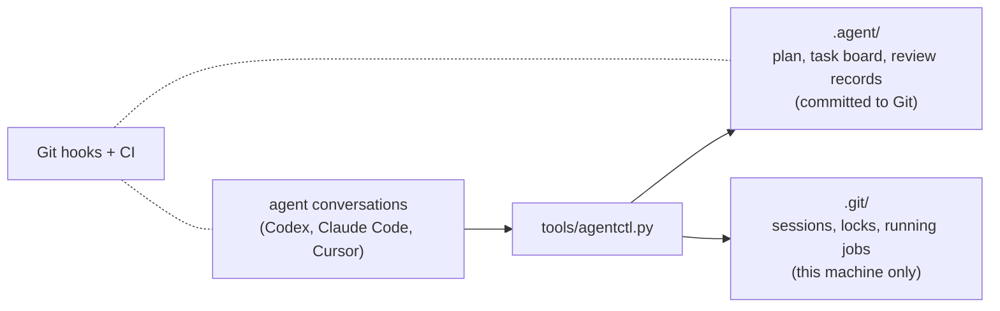

# Agent Workflow Kit

[](https://github.com/asimfish/agent-workflow-kit/actions/workflows/agent-workflow-check.yml)
[](LICENSE)

English | [中文](README_CN.md)

Lets several AI coding agents work on one repository and one set of GPUs
without stepping on each other.

- **One plan, read by everyone.** Every agent reads `.agent/PROJECT_PLAN.md`
  and the task board before it touches a file. You steer by editing the plan.
- **One owner per task.** A task and the paths it may write belong to one
  conversation at a time. Overlapping claims are refused. If a conversation
  dies, its task can be taken over deliberately, never stolen silently.
- **Nothing merges unreviewed.** A different conversation has to approve.
  Long jobs and GPUs are tracked, so a dead conversation cannot leave a card
  locked or a training run unwatched.

It is one Python script and a folder of plain files committed to Git. No
daemon, no server, no dependency beyond Python 3.9.

## Install

```bash
git clone https://github.com/asimfish/agent-workflow-kit.git
cd agent-workflow-kit
./install.sh /path/to/your/project
```

Or tell an agent inside your project:
`Install https://github.com/asimfish/agent-workflow-kit.git into this project.`

The installer merges into existing files and is safe to run again. It adds
`.agent/` (the plan, the task board, rules), `tools/agentctl.py` (the
controller), Git hooks, and hook entries for Codex, Claude Code, and Cursor.
Nothing goes on your `PATH`: `agentctl` in this document means
`python3 tools/agentctl.py`, run from the project root. Agents already use
the long form because `.agent/WORKFLOW_ENTRY.md` tells them to.

From then on the only thing you need to say to an agent is:

> Follow .agent and start work.
> (or in Chinese: 按 .agent 规范开始工作。)

Upgrades and migration: `docs/install-and-upgrade.md`.

## Five minutes with it

This is what happens on a normal day. **You** do the first and last step;
**agents** do the rest by following `.agent/WORKFLOW_ENTRY.md`. Every
command below was run as written on a fresh install.

**You: point a conversation at the project.** Say "Follow .agent and start
work." to any agent session. Before it edits anything, the agent claims a
task and the paths it will write:

```bash
agentctl work --agent codex                        # take an existing task
agentctl work --agent codex --auto-create \
    --title "fix the data loader" --scope "src/data/"   # or open a new one
```

A second conversation that asks for the same task, or for a path inside
`src/data/`, is refused. Code and experiment tasks get their own Git
worktree automatically, so two agents never edit the same checkout.

**Agent: work and leave a trail.**

```bash
agentctl note "root cause: off-by-one in shard split"
```

**Agent: run anything long through the kit, not a bare shell.** The job
keeps running after the conversation ends, shows up on the board, and can
hold a GPU:

```bash
agentctl run start --task T-001 --output .agent-artifacts/T-001/ \
    --resource gpu:0 --gpu-watchdog -- python train.py
agentctl run list
```

Outputs go under `.agent-artifacts/<task>/` (gitignored by the installer)
or inside the task's own paths. With `--gpu-watchdog`, a process that holds
VRAM at zero utilization past a grace period is reclaimed; compile phases
can declare an exemption.

**Agent: hand the task to review.**

```bash
agentctl finish --summary "..." --tests "pytest -x: 42 passed"
```

The task is now `review`. Until this point the Git hooks refused to push
its commits; now the branch can be pushed and a pull request opened, but
by the kit's rules it merges only after someone else approves.

**Reviewer: a different conversation approves.** The reviewer registers
once per project, opens a review task, and decides:

```bash
agentctl agents add --id reviewer --role review
agentctl work --agent reviewer --auto-create --type review \
    --title "review T-001" --scope ".agent/"
agentctl gate approve --task T-001 --by reviewer --note "..."
```

The controller compares runtime fingerprints, so a conversation cannot
approve its own work. For a task that ran in a worktree, bring its records
back to the main checkout with `agentctl reconcile merge-back --from-ref
<branch>` before opening the pull request (`docs/worktree-merge-back.md`).

**You: look whenever you like.**

```bash
agentctl board      # who is doing what, which jobs are running
agentctl doctor     # anything stuck, and the command that unsticks it
```

Both work from a plain terminal; no agent session is needed.

## The rules



- **Plan and tasks are files in Git.** `.agent/PROJECT_PLAN.md` is the plan,
  `.agent/board.json` the task board, `.agent/tasks/` one document per
  task. Agents update them through `agentctl`; humans edit the plan and the
  rules directly, and agents re-read them before continuing.
- **A claim is a task plus a write scope.** Two conversations cannot hold
  the same task, and scopes may not overlap. Hooks reject writes outside
  the claimed scope.
- **A silent conversation goes stale, not away.** After 30 minutes without
  a heartbeat its claims are flagged. Others see the warning and keep
  working. Taking over requires an explicit `sessions release` with a
  reason; nothing is reassigned automatically.
- **Long jobs are leases, not shell processes.** `agentctl run` supervises
  the job, records its outputs and resources, and outlives the conversation.
  Dead jobs release their GPU; the optional watchdog reclaims cards that are
  held but idle. Telemetry failures never kill anything.
- **Review is enforced, not requested.** Merging needs green CI and an
  approval from a conversation whose runtime never touched the change.
- **GPU locks are machine-wide.** A card claimed by one project is
  unavailable to every other project on the host until released. The lock
  records who holds it, so any project can tell a live holder from a dead
  one.
- **Several machines share the plan through Git.** Sessions and locks stay
  on their machine; the ledger under `.agent/` travels. A claim can be
  pushed while the task is still `in_progress` (code and anything that
  changes agent behavior cannot), the ledger
  files merge per task instead of conflicting per line, and a task that
  another machine has claimed can only be taken with `--takeover --reason`.

## Everyday commands

| Command | What it does |
|---|---|
| `agentctl work --agent <name>` | claim or resume a task (`--auto-create` opens a new one) |
| `agentctl note "..."` | record progress on the current task |
| `agentctl finish --summary ... --tests ...` | hand the task to review |
| `agentctl run start -- <command>` | supervised background job; `run list`, `run stop` |
| `agentctl gate approve --task <id> --by <reviewer>` | independent approval (or `gate reject`) |
| `agentctl board` | who is doing what |
| `agentctl doctor` | what is stuck, and how to unstick it |
| `agentctl sync` | publish this checkout's claims and pick up everyone else's (ledger-only commit, pull, push) |

The full reference is `docs/workflow.md`. Loops, supervisor guidance
packets, harness evaluation, and upgrade barriers live in `docs/` and can
wait until you need them.

## When something is stuck

`agentctl doctor` names the recovery command for each finding. The common
cases:

| What you see | What happened | What to run |
|---|---|---|
| a task is `in_progress` but its conversation is gone | the session went stale | inspect the task document, then `agentctl sessions release <session> --reason "..."` and `agentctl start --task <id> --agent <name>`; releasing also frees the GPUs that session held |
| `resource acquire gpu:0` is refused and `doctor` shows a lease with no live holder | a run or session died holding the card | `agentctl resource release <lease-id> --force-stale --reason "..."`; live holders are always refused |
| the refusal says the lock belongs to *another checkout* | a different project on this machine holds it | if that project's own records prove the holder dead, the next `resource acquire` releases it; otherwise `agentctl resource release --lock gpu:0 --force-stale --reason "..."` |
| a run shows `exited_unknown` | the supervisor lost track of the process | inspect the outputs, then `agentctl run finish <run-id> --status succeeded\|failed --reason "..."` |
| `gate approve` says the task is unknown or has no runtime evidence | the task finished in a worktree and the main checkout has not heard of it | `agentctl reconcile merge-back --from-ref <branch>` in the main checkout, then retry |
| a review task is still open after its decision | nobody closed it | `agentctl reconcile close-decided-reviews` |
| `git pull` stops with conflicts in `.agent/board.json` or `TASKS.md` | this clone has no ledger merge driver (`doctor` says so) | `agentctl init .` registers it and writes `.gitattributes`; commit `.gitattributes`, then `git rebase --continue` after resolving once |
| `start --task` says the task is `in_progress` for someone according to the board | another machine claimed it | check its notes; if it is really abandoned, `agentctl work --agent <name> --task <id> --takeover --reason "..."` |

Nothing above deletes work. Releasing a session keeps its task, notes, and
files; releasing a lock never kills a process.

## What it does not do

No daemon, no cron, no automatic merges, no automatic deletion of branches
or worktrees, and no sandbox: the hooks coordinate agents, they do not
contain untrusted code. Jobs started outside `agentctl run` (a raw `ssh`, a
`systemd` unit) are reported but not managed. GPU coordination is per host;
the kit does not schedule across machines, and it cannot tell whether a
conversation on another machine is still alive, only that its claim is on
the board.

## Status

236 regression tests run on Linux in CI; a Windows job runs the subset that
exercises Windows-specific process handling. The coordination guarantees
were also exercised end to end on a fresh install: concurrent
conversations, a conversation that died holding a GPU, a project deleted
while it held a lock, an independent reviewer, and adversarial state
surgery against the lease and review checks. GPU supervision was validated
on shared RTX 5090s. What changed and why is in `CHANGELOG.md`.

Known limits: a stale conversation cannot be told apart from a slow one, so
takeover is always a human or supervisor decision; locks held by another
user whose checkout you cannot read are reported but never released
automatically; remote (`ssh://`) GPU locks are report-only.

## Documentation

- `docs/install-and-upgrade.md` -- install, upgrade, migration
- `docs/workflow.md` -- task lifecycle, review gates, worktrees, full command list
- `docs/multi-session-execution.md` -- coordination rules, GPU supervision, interlock recovery
- `docs/worktree-merge-back.md` -- from a finished worktree task to an approved merge
- `docs/loop-engineering.md` -- checkpoint loops
- `docs/harness-evaluation.md` -- evaluating changes to the kit itself
- `CHANGELOG.md`, `CONTRIBUTING.md`, `LICENSE`

MIT licensed. Contributions go through the same task-and-review workflow
the kit enforces; see `CONTRIBUTING.md`.
