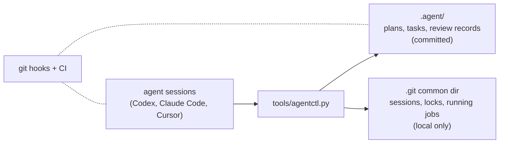

# Agent Workflow Kit

[](https://github.com/asimfish/agent-workflow-kit/actions/workflows/agent-workflow-check.yml)
[](LICENSE)

English | [中文](README_CN.md)

Task tracking and coordination for AI coding agents that share repositories
and GPU machines.

If you run several agent conversations against one project, you have seen
the failure modes. Two sessions pick up the same task. A conversation dies
and its half-claimed task blocks everyone else for good. An experiment
launched over SSH outlives its conversation and nobody watches it. A
finished job sits on 20 GB of VRAM at zero utilization for three days.
An agent merges its own unreviewed code.

This kit prevents those things with plain files and a single Python script.
There is no daemon, no server, and no dependency beyond Python 3.9. Agents
write their plans, tasks, and review decisions into `.agent/` as Markdown
and JSON that get committed like any other file. Live coordination state --
who is working, what is locked, which processes and GPUs are claimed --
stays in the Git common directory and never leaves the machine. Git hooks
and CI check what agents try to commit.

## Install

```bash
git clone https://github.com/asimfish/agent-workflow-kit.git
cd agent-workflow-kit
./install.sh /path/to/your/project
```

Or just tell an agent inside your project:
`Install https://github.com/asimfish/agent-workflow-kit.git into this project.`

Installation merges with existing files instead of overwriting them, and
running it again is harmless. Afterwards the only prompt a human needs is:

```text
按 .agent 规范开始工作。
```

Details, upgrades, and migration: `docs/install-and-upgrade.md`.

Nothing is added to your `PATH`. Every `agentctl` below is shorthand for
`python3 tools/agentctl.py`, run from the project root; add
`alias agentctl='python3 tools/agentctl.py'` if you type it often. Agents
already use the long form because `.agent/WORKFLOW_ENTRY.md` tells them to.

## Your first task, end to end

What actually happens on day one, so you know what to expect. The human
does step 1 and step 5; agents do the rest by following
`.agent/WORKFLOW_ENTRY.md` on their own. Every command here was run
verbatim against a fresh install before this was written.

**1. Point a session at the project.** Say `按 .agent 规范开始工作。` (or
"work by the .agent rules") to any agent session. It claims a task before
touching files:

```bash
agentctl work --agent codex                 # picks up an existing task
agentctl work --agent codex --auto-create \
    --title "fix the data loader" --scope "src/data/"   # or creates one
```

The claim records a write scope. A second session asking for the same task
or an overlapping scope is refused, which is the point.

**2. The agent works and leaves a trail.**

```bash
agentctl note "root cause: off-by-one in shard split"
```

**3. Long jobs outlive the conversation.** Anything that runs for hours
goes through `run start`, not a bare shell, so it keeps running when the
chat dies and shows up on the board:

```bash
agentctl run start --task T-001 --output .agent-artifacts/T-001/ \
    --resource gpu:0 --gpu-watchdog -- python train.py
agentctl run list                            # status, PIDs, logs
```

Declared outputs must sit inside the task's write scope or under
`.agent-artifacts/<task>/`, which the install gitignores so checkpoints
never get staged by accident. With `--gpu-watchdog`, a process squatting
on VRAM at zero utilization past the grace period gets reclaimed;
compilation phases can declare exemptions.

**4. The agent hands the task to review.**

```bash
agentctl finish --summary "..." --tests "pytest -x: 42 passed"
```

The task enters `review` and git hooks now block pushes of unreviewed
work. A *different* session — one whose runtime never touched the
implementation — registers itself as a reviewer once, claims a review
task, and decides:

```bash
agentctl agents add --id reviewer-name --role review      # once per project
agentctl work --agent reviewer-name --auto-create --type review \
    --title "review T-001" --scope ".agent/"
agentctl gate approve --task T-001 --by reviewer-name --note "..."
```

Self-approval fails: the controller compares runtime fingerprints, not
good intentions. Code tasks run in their own worktree; after the gate,
bring the result back with `agentctl reconcile merge-back --from-ref
<branch>` (see `docs/worktree-merge-back.md`).

**5. You check in whenever you like.**

```bash
agentctl board      # who is doing what, which runs are live
agentctl doctor     # stale sessions, orphaned leases, interlocked GPUs
```

Both work from any plain terminal; they need no agent session. `doctor`
names the recovery command for anything it flags; nothing is reclaimed
behind your back.

## How it works



Everything an agent does goes through `agentctl`. Starting work claims a
task and a write scope; two sessions cannot hold the same task, and scopes
that overlap are refused. A session that stops sending heartbeats becomes
stale: other agents get a warning and keep working, but nobody silently
steals its task.

Long jobs run under `agentctl run`, which survives the conversation that
started them. A run can lease a GPU, and an optional watchdog reclaims the
card when a process holds memory but shows no utilization and no progress
for long enough -- with a grace period, an exemption mechanism for
compilation phases, and a bias toward keeping things alive when telemetry
fails. This was tested on real shared RTX 5090s, not just in unit tests.

Merging to main takes two things: green CI, and a review approval recorded
by a session whose runtime provably never touched the implementation. An
agent cannot approve its own work, and the controller checks that, not
the agent's honesty.

## Daily commands

```text
agentctl work --agent <name>            claim or resume a task
agentctl note "..."                     record progress
agentctl finish --summary ... --tests   hand the task to review
agentctl run start -- <command>         supervised background job
agentctl gate approve --task --by       independent review approval
agentctl board                          what is everyone doing
agentctl doctor                         is the workflow healthy
```

The full command list is in `docs/workflow.md`. Most people never need
more than the seven above; loops, supervisor guidance packets, harness
evaluation, and upgrade barriers are documented in `docs/` and can be
ignored until you want them.

## What it does not do

No background daemon, no cron, no automatic merges to protected branches,
no automatic deletion of worktrees or branches, and no sandboxing -- the
hooks are coordination guardrails, and untrusted code still needs a real
sandbox. Jobs started outside `agentctl run` (raw ssh, systemd) are
reported but not managed.

## Status and known limitations

The controller, the lease model, GPU supervision, and the review gate are
covered by 222 regression tests, CI on Linux and Windows, and a
seven-scenario acceptance run against a fresh clone. The acceptance run
was adversarial where it matters: forged lease timestamps, deleted session
records, orphaned resources, replayed creation requests, and a same-runtime
approval attempt were all refused or healed as designed. A second pass
replayed the walkthrough above, command by command, on a blank project
with three concurrent conversations, a dead GPU holder, and an
independent reviewer.

The rough edges found there have since been fixed: `agentctl reconcile
merge-back` now moves a finished worktree task's ledger into the planning
checkout (see `docs/worktree-merge-back.md`), an explicit `--auto-create`
request refuses to silently resume unrelated work, the refusal messages
around worktree isolation, gate approval, and reviewer registration name
the step that actually resolves them, `doctor` runs from a plain terminal
without an agent session, and the default artifact root is gitignored on
install.

## Documentation

- `docs/install-and-upgrade.md` -- install, upgrade, migration
- `docs/workflow.md` -- the task lifecycle, review gates, worktrees
- `docs/multi-session-execution.md` -- coordination rules and GPU supervision
- `docs/worktree-merge-back.md` -- walking a finished worktree task to an approved merge
- `docs/loop-engineering.md` -- checkpoint loops
- `docs/harness-evaluation.md` -- evaluating changes to the kit itself
- `CHANGELOG.md`, `CONTRIBUTING.md`, `LICENSE`

MIT licensed. Contributions go through the same task-and-review workflow
the kit enforces; see `CONTRIBUTING.md`.
