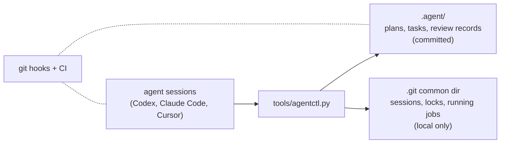

# Agent Workflow Kit

[](https://github.com/asimfish/agent-workflow-kit/actions/workflows/agent-workflow-check.yml)
[](LICENSE)

English | [中文](README_CN.md)

Task tracking and coordination for AI coding agents that share repositories
and GPU machines.

If you run several agent conversations against one project, you have seen
the failure modes. Two sessions pick up the same task. A conversation dies
and its half-claimed task blocks everyone else for good. An experiment
launched over SSH outlives its conversation and nobody watches it. A
finished job sits on 20 GB of VRAM at zero utilization for three days.
An agent merges its own unreviewed code.

This kit prevents those things with plain files and a single Python script.
There is no daemon, no server, and no dependency beyond Python 3.9. Agents
write their plans, tasks, and review decisions into `.agent/` as Markdown
and JSON that get committed like any other file. Live coordination state --
who is working, what is locked, which processes and GPUs are claimed --
stays in the Git common directory and never leaves the machine. Git hooks
and CI check what agents try to commit.

## Install

```bash
git clone https://github.com/asimfish/agent-workflow-kit.git
cd agent-workflow-kit
./install.sh /path/to/your/project
```

Or just tell an agent inside your project:
`Install https://github.com/asimfish/agent-workflow-kit.git into this project.`

Installation merges with existing files instead of overwriting them, and
running it again is harmless. Afterwards the only prompt a human needs is:

```text
按 .agent 规范开始工作。
```

Details, upgrades, and migration: `docs/install-and-upgrade.md`.

## How it works



Everything an agent does goes through `agentctl`. Starting work claims a
task and a write scope; two sessions cannot hold the same task, and scopes
that overlap are refused. A session that stops sending heartbeats becomes
stale: other agents get a warning and keep working, but nobody silently
steals its task.

Long jobs run under `agentctl run`, which survives the conversation that
started them. A run can lease a GPU, and an optional watchdog reclaims the
card when a process holds memory but shows no utilization and no progress
for long enough -- with a grace period, an exemption mechanism for
compilation phases, and a bias toward keeping things alive when telemetry
fails. This was tested on real shared RTX 5090s, not just in unit tests.

Merging to main takes two things: green CI, and a review approval recorded
by a session whose runtime provably never touched the implementation. An
agent cannot approve its own work, and the controller checks that, not
the agent's honesty.

## Daily commands

```text
agentctl work --agent <name>            claim or resume a task
agentctl note "..."                     record progress
agentctl finish --summary ... --tests   hand the task to review
agentctl run start -- <command>         supervised background job
agentctl gate approve --task --by       independent review approval
agentctl board                          what is everyone doing
agentctl doctor                         is the workflow healthy
```

The full command list is in `docs/workflow.md`. Most people never need
more than the seven above; loops, supervisor guidance packets, harness
evaluation, and upgrade barriers are documented in `docs/` and can be
ignored until you want them.

## What it does not do

No background daemon, no cron, no automatic merges to protected branches,
no automatic deletion of worktrees or branches, and no sandboxing -- the
hooks are coordination guardrails, and untrusted code still needs a real
sandbox. Jobs started outside `agentctl run` (raw ssh, systemd) are
reported but not managed.

## Documentation

- `docs/install-and-upgrade.md` -- install, upgrade, migration
- `docs/workflow.md` -- the task lifecycle, review gates, worktrees
- `docs/multi-session-execution.md` -- coordination rules and GPU supervision
- `docs/loop-engineering.md` -- checkpoint loops
- `docs/harness-evaluation.md` -- evaluating changes to the kit itself
- `CHANGELOG.md`, `CONTRIBUTING.md`, `LICENSE`

MIT licensed. Contributions go through the same task-and-review workflow
the kit enforces; see `CONTRIBUTING.md`.
