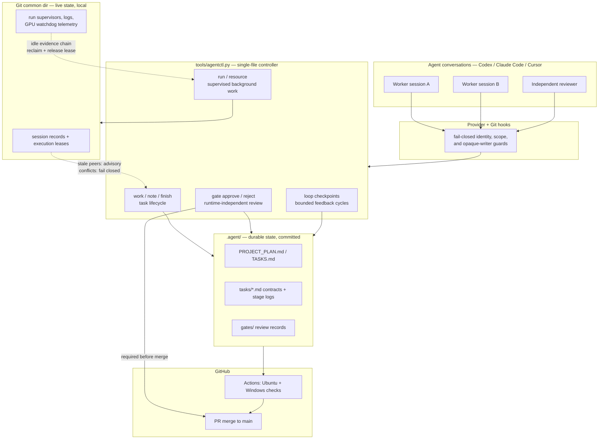

# Agent Workflow Kit

[](https://github.com/asimfish/super_project/actions/workflows/agent-workflow-check.yml)
[](LICENSE)
[](tools/agentctl.py)
[](.github/workflows/agent-workflow-check.yml)

**English** | [中文](README_CN.md)

Project-level workflow kit for AI agents. Install it into any Git repository so
Codex, Claude Code, Cursor, or another coding agent can follow the same plan,
task docs, loop checks, and GitHub standards without the human repeating the
workflow every time. One dependency-free Python file, durable Markdown state,
fail-closed coordination.

Repository: <https://github.com/asimfish/super_project>

## Quick Start

Ask an agent, from inside your target project:

```text
Install https://github.com/asimfish/super_project.git into this project.
```

Or install manually:

```bash
git clone https://github.com/asimfish/super_project.git
cd super_project
./install.sh /path/to/your/project        # = python3 tools/agentctl.py init <path>
```

Installation is preflighted and idempotent: existing `AGENTS.md`, PR template,
and provider hook JSON are merged in managed sections, and project-owned
`.agent/` content is seeded only when absent. Trust the project hooks when the
client asks, then start normal work with the one prompt humans need:

```text
按 .agent 规范开始工作。
```

Upgrades, the drain barrier, `upgrade rebind`, `migrate` actions, and the
identity policy are covered in `docs/install-and-upgrade.md`.

## What It Installs

```text
AGENTS.md
tools/agentctl.py
tools/agent_workflow_hook.py
.githooks/{pre-commit,commit-msg,pre-push}
.codex/hooks.json
.claude/settings.json
.cursor/hooks.json
.github/workflows/agent-workflow-check.yml
.agent/
  WORKFLOW_ENTRY.md
  PROJECT_PLAN.md
  TASKS.md
  board.json
  agents.json
  tasks/  loops/  rules/  logs/  handoffs/  decisions/  gates/
  state/          # local only, gitignored; includes generated SESSIONS.md
```

The installed `.agent/` directory belongs to that project. It is not a global
agent memory.

## Architecture



How to read it: conversations never touch state directly — every tool call
passes the hook guards and every state change goes through the controller.
Durable state (plans, task contracts, gate records) is committed and reviewed;
live state (sessions, leases, run supervision) stays in the Git common
directory and heals itself. Merging to `main` requires both green CI and a
gate decision recorded by a reviewer whose host runtime never participated in
the work.

## Daily Use

Humans do not run workflow commands during normal work. You mainly inspect and
edit the durable state:

```text
.agent/PROJECT_PLAN.md      direction, priorities, acceptance criteria
.agent/TASKS.md             task index (generated view)
.agent/tasks/*.md           per-task contracts, stage logs, evidence
.agent/rules/*.md           operating and GitHub rules
.agent/loops/checkpoints.json
```

If direction or scope is wrong, edit those files; the next agent run must
re-read them and continue from the durable state.

### Agent work cycle

1. Read `AGENTS.md`, `.agent/WORKFLOW_ENTRY.md`, the plan, and the task doc.
2. `agentctl work --agent <name>` (or `--auto-create --title ... --scope ...
   --type code|experiment|docs|review|maintenance|generic`).
3. Work only inside the active scope or the managed worktree printed by `work`.
4. Record progress with `agentctl note "..."`; finish with `agentctl finish
   --summary "..." --tests "..."`.
5. An independent reviewer (separate session, different host runtime than every
   recorded worker runtime) runs `agentctl gate approve --task <task> --by
   <reviewer>`. Review-type tasks that issued a recorded gate decision close
   themselves on finish.
6. Commit with Conventional Commits plus a task ID; push only after hooks pass.

`work` and `finish` run the checkpoint loops automatically.

## Multiple Conversations In One Project

Open several conversations in the same project and give each the same short
prompt; no session-management command is required. Every conversation gets a
private session key, publishes its task, scope, heartbeat, and claims under the
Git common directory, and shows up in the generated `.agent/state/SESSIONS.md`.

The coordination policy in one paragraph: disjoint scopes run concurrently;
task type picks isolation (`code`/`experiment` get managed worktrees, `docs`
shares the checkout, `review` is read-only, `maintenance` is exclusive); the
same task never runs twice across linked worktrees; Git index/branch/push
operations and statically unverifiable writers (interpreters, build tools,
archive tools, unknown executables) are exclusive per checkout; controller
files are owned by `agentctl` commands, not direct edits; stale sessions are
advisory warnings for unrelated work but same-task and overlapping-scope
conflicts stay fail-closed; background work runs under `agentctl run` with
holder-bound resources, single-use supervisor claims, and an opt-in GPU
watchdog that needs consecutive low-utilization, allocated-memory,
absent-progress, and grace evidence before reclaiming — probe failures keep
resources, remote GPUs are report-only, and terminal run state plus artifacts
age out on a retention policy.

Full invariants, identity binding for forks/clones, opaque-writer rules,
document ownership, and GPU supervision details: `docs/multi-session-execution.md`.

These hooks are coordination guardrails, not an OS sandbox; untrusted code
still needs an external sandbox.

## Loops

A loop is a bounded feedback cycle (Trigger → Execute → Check → Feedback →
Memory → Next), never a background daemon. Checkpoints (`work-start`,
`pre-finish`, `post-finish`, `experiment-check`) run built-in loops such as
`daily-plan-triage` and `doc-hygiene`; failures become durable follow-up
packets that escalate after repeated failures and block `finish` until fixed
or explicitly acknowledged.

```bash
python3 tools/agentctl.py loop run daily-plan-triage --once
python3 tools/agentctl.py loop cycle --checkpoint experiment-check --cycles 6 --interval 600
python3 tools/agentctl.py loop status
```

Contract, custom `loop-check` blocks, cycle runtime semantics, and escalation
policy: `docs/loop-engineering.md`.

## Supervisor Guidance And Evaluation

A stronger planning model can register a worker session, send a durable
guidance packet, dispatch one bounded non-interactive worker turn, and verify
the signed contract, receipt, acknowledgement, and completion evidence before
gating — the worker cannot self-approve. Harness changes additionally run
deterministic baseline/candidate evaluation with held-in/held-out suites.

Details: `docs/workflow.md` (dispatch and verification) and
`docs/harness-evaluation.md` (suite schema and trust boundary).

## Common Commands

```text
agentctl init [path]                                install into a project
agentctl work --agent <name>                        resume or claim work
agentctl work --agent <name> --auto-create --title --scope --type
agentctl focus | capsule [--json]                   reprint task focus / bounded context
agentctl note "..."                                 record progress
agentctl finish --summary "..." --tests "..."       move task to review
agentctl gate approve|reject --task --by            independent review gate
agentctl gate reconcile-github --task --by --pr     sync a human-merged PR to done
agentctl guidance create|list|show|ack|dispatch|verify   supervisor guidance packets
agentctl eval list|run|show|compare|gate            baseline/candidate evaluation
agentctl loop list|show|run|auto|cycle|status|resume|stop
agentctl worktree create|list|release               managed worktree leases
agentctl lease list [--json]                        unified execution ownership
agentctl run start|adopt|list|show|wait|progress|finish|stop
agentctl resource acquire|status|release            local or SSH resource leases
agentctl upgrade begin|status|validate|complete|rebind
agentctl reconcile check|render|migrate|close-decided-reviews
agentctl board [--json]                             show board
agentctl check --mode manual|pre-commit|commit-msg|pre-push|ci
agentctl doctor [--json]                            workflow health check
agentctl migrate [--json]                           audit an upgraded/older session
agentctl sessions list|heartbeat|guard|release      session records
```

## GitHub Standards

Conventional Commits with a task ID (`Refs: T-001`). Local hooks enforce
matching `.agent` updates, commit format, task references, pushable task
status (`review`/`approved`/`done`), completion records for `done`, and a
secret scan; CI reruns the same checks plus the full regression suite on
Ubuntu and the run-lifecycle/dispatch checks on Windows. See
`.agent/rules/github-standards.md`.

## Diagnostics And Tests

```bash
python3 tools/agentctl.py doctor       # read-only workflow health check
python3 -m unittest discover -s tests  # full regression suite
```

The regression tests install the kit into fresh temporary Git projects and
replay the coordination, loop, guidance, worktree, run/resource, GPU
supervision, upgrade-barrier, and evaluation contracts end to end.

## Current Boundaries

Intentionally not included:

- a background daemon or cron scheduler;
- automatic worktree pools or branch deletion;
- external connector loops;
- automatic expensive experiment launches;
- automatic merge to protected branches;
- automatic harness mutation or acceptance without held-in/held-out evidence.

## More Detail

- `docs/install-and-upgrade.md`: install, upgrade, drain barrier, migrate actions, identity policy.
- `docs/workflow.md`: full workflow reference, supervisor dispatch, worktrees.
- `docs/multi-session-execution.md`: multi-session invariants, GPU supervision, retention.
- `docs/loop-engineering.md`: loop contract and checkpoint model.
- `docs/harness-evaluation.md`: deterministic suite schema and trust boundary.
- `docs/enforcement.md`: hook and GitHub enforcement layers.
- `.agent/rules/github-standards.md`: commit, push, and PR standards.
- `CHANGELOG.md`: notable released changes.

## Contributing

Contributions go through the same workflow the kit ships — task, tests,
independent review gate, PR. See [CONTRIBUTING.md](CONTRIBUTING.md) and the
issue templates.

## License And Citation

MIT — see [LICENSE](LICENSE). If this kit is useful in your research or
tooling, cite it via [CITATION.cff](CITATION.cff).
