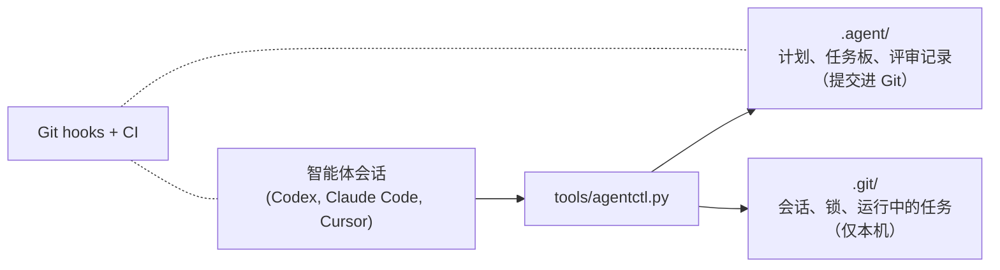

# Agent Workflow Kit（智能体工作流套件）

[](https://github.com/asimfish/agent-workflow-kit/actions/workflows/agent-workflow-check.yml)
[](LICENSE)

[English](README.md) | 中文

让多个 AI 编码智能体在同一个仓库、同一批显卡上干活，而互不干扰。

- **一份计划，所有人都看。** 每个智能体动手之前都先读 `.agent/PROJECT_PLAN.md`
  和任务板。你想调整方向，改计划文件就行。
- **一个任务只有一个主人。** 任务和它允许写的路径，同一时刻只属于一个会话；
  申请重叠的范围会被拒绝。会话死了，任务可以被明确接管，但不会被悄悄抢走。
- **没评审的东西合不进去。** 必须由另一个会话批准。长任务和显卡都有登记，
  会话死掉不会留下一张锁死的卡或一个没人管的训练。

整个套件就是一个 Python 脚本加一个提交进 Git 的纯文件目录。没有守护进程，
没有服务器，除 Python 3.9 外没有依赖。

## 安装

```bash
git clone https://github.com/asimfish/agent-workflow-kit.git
cd agent-workflow-kit
./install.sh /path/to/your/project
```

或者直接在你的项目里对智能体说一句：
`Install https://github.com/asimfish/agent-workflow-kit.git into this project.`

安装会合并进已有文件，重复执行没有副作用。它会加入 `.agent/`（计划、任务板、
规则）、`tools/agentctl.py`（控制器）、Git hooks，以及 Codex / Claude Code /
Cursor 的 hook 配置。**不会往 `PATH` 里加任何东西**：本文里的 `agentctl`
都指在项目根目录执行 `python3 tools/agentctl.py`。智能体用的本来就是完整写法，
因为 `.agent/WORKFLOW_ENTRY.md` 里就是这么写的。

然后按安装器最后打印的 `git add` 和 `git commit` 两行，把安装本身单独提交一次。
这一次提交不需要任务：hooks 能识别出“把套件加进仓库”的那个提交，只要里面
全是安装器写入的文件就放行。规则从下一个提交开始生效。

装好之后，你对智能体只需要说：

> 按 .agent 规范开始工作。

升级与迁移见 `docs/install-and-upgrade.md`。

## 五分钟走一遍

下面是平常一天会发生的事。**你**只做第一步和最后一步，中间都由**智能体**按
`.agent/WORKFLOW_ENTRY.md` 自己完成。每条命令都在全新安装的空项目上原样跑过。

**你：把一个会话指向项目。** 对任意智能体会话说「按 .agent 规范开始工作。」
它在改任何文件之前，先认领一个任务和要写的路径：

```bash
agentctl work --agent codex                        # 领取已有任务
agentctl work --agent codex --auto-create --type code \
    --title "fix the data loader" --scope "src/data/"   # 或者新开一个
```

第二个会话如果想领同一个任务，或者申请 `src/data/` 之内的路径，会被拒绝。
`code` 和 `experiment` 类型的任务会自动分到独立的 Git worktree（命令会打印
接着去哪里干活），两个智能体永远不会在同一个检出里改文件；`docs`、`review`、
`generic` 类型共用当前检出。

**智能体：干活，并留下痕迹。**

```bash
agentctl note "root cause: off-by-one in shard split"
```

**智能体：跑得久的东西都走套件，不走裸 shell。** 任务在对话结束后照跑，
出现在任务板上，还能占一张卡：

```bash
agentctl run start --task T-001 --output .agent-artifacts/T-001/ \
    --resource gpu:0 --gpu-watchdog -- python train.py
agentctl run list
```

输出放在 `.agent-artifacts/<task>/`（安装时已加入 gitignore）或任务自己的
路径下。带 `--gpu-watchdog` 时，占着显存但利用率长期为零、超过宽限期的进程
会被回收；编译阶段可以声明豁免。

**智能体：把任务交给评审。**

```bash
agentctl finish --summary "..." --tests "pytest -x: 42 passed"
```

任务进入 `review`。在此之前 Git hooks 一直拒绝推送它的提交；现在分支可以推送、
可以开 PR，但按套件的规则，要等别人批准之后才能合并。

**评审者：由另一个会话批准。** 评审者在每个项目里注册一次，开一个评审任务，
然后裁决：

```bash
agentctl agents add --id reviewer --role review
agentctl work --agent reviewer --auto-create --type review \
    --title "review T-001" --scope ".agent/"
agentctl gate approve --task T-001 --by reviewer --note "..."
agentctl finish --summary "approved T-001" --tests "..."   # 关闭评审任务
```

控制器比对的是运行时指纹，所以一个会话没法批准自己的工作。评审者自己的
`finish` 会按已记录的裁决直接关闭评审任务，不会再要求“评审的评审”。在 worktree 里
完成的任务，开 PR 之前先用 `agentctl reconcile merge-back --from-ref <branch>`
把它的记录搬回主检出（见 `docs/worktree-merge-back.md`）。

**你：想看就看。**

```bash
agentctl board      # 谁在干什么、哪些任务在跑
agentctl doctor     # 哪里卡住了、用哪条命令解开
```

这两条在普通终端里就能跑，不需要智能体会话。

## 规则



- **计划和任务都是 Git 里的文件。** `.agent/PROJECT_PLAN.md` 是计划，
  `.agent/board.json` 是任务板，`.agent/tasks/` 下每个任务一份文档。智能体通过
  `agentctl` 更新它们；人直接改计划和规则，智能体继续之前会重新读。
- **一次认领 = 一个任务 + 一个写范围。** 两个会话不能持有同一个任务，写范围
  不能重叠。hooks 会拒绝范围之外的写入。
- **失联的会话是「过期」，不是「消失」。** 30 分钟没有心跳，它的认领会被标记
  出来。其他人看到警告后照常干活。接管必须显式执行 `sessions release` 并写明
  理由，没有任何东西会被自动重新分配。
- **长任务是租约，不是 shell 进程。** `agentctl run` 监管任务、登记输出和资源，
  并且比对话活得久。死掉的任务会释放显卡；可选的 watchdog 会回收占着不用的卡。
  遥测失败时宁可不杀。
- **评审是强制的，不是请求。** 合并需要 CI 全绿，加上一个从未碰过这份改动的
  会话给出的批准。
- **显卡锁是机器级的。** 一张卡被某个项目占用后，同一台机器上的其它项目都拿
  不到，直到被释放。锁里记录了持有者是谁，所以任何项目都能分辨持有者是活着
  还是死了。
- **多台机器通过 Git 共享计划。** 会话和锁留在各自的机器上，`.agent/` 下的账本
  随 Git 流动。任务还在 `in_progress` 时就可以把认领推送出去（代码和任何会改变智能体
  行为的文件不行）；账本
  文件按任务合并而不是按行冲突；别的机器认领的任务只能用 `--takeover --reason`
  接管。新克隆的仓库里 hooks 只在文件树里、不在 Git 配置里：在那里执行的第一次
  `agentctl work` 会先把 hooks 和合并驱动接上，再写任何任务状态；如果
  `core.hooksPath` 已经指向别处，则拒绝开始。

## 日常命令

| 命令 | 作用 |
|---|---|
| `agentctl work --agent <name>` | 认领或恢复任务（`--auto-create` 新开一个） |
| `agentctl note "..."` | 给当前任务记一笔进度 |
| `agentctl finish --summary ... --tests ...` | 把任务交给评审 |
| `agentctl run start -- <command>` | 受监管的后台任务；另有 `run list`、`run stop <run-id> --reason "..."` |
| `agentctl gate approve --task <id> --by <reviewer>` | 独立批准（或 `gate reject`） |
| `agentctl board` | 谁在干什么 |
| `agentctl doctor` | 哪里卡住了、怎么解 |
| `agentctl sync` | 发布本检出的认领、拉回其他人的（只提交账本，拉取，推送） |

完整参考在 `docs/workflow.md`。循环、supervisor 指导包、harness 评估、升级屏障
都在 `docs/` 里，用到再看。

## 卡住了怎么办

`agentctl doctor` 会对每一条发现给出对应的恢复命令。常见情况：

| 你看到的 | 发生了什么 | 怎么做 |
|---|---|---|
| 任务是 `in_progress`，但它的会话已经不在了 | 会话过期 | 先看任务文档，然后 `agentctl sessions release <session> --reason "..."`，再 `agentctl start --task <id> --agent <name>`；释放会话会顺带释放它占的显卡 |
| `resource acquire gpu:0` 被拒，`doctor` 显示一条没有活体持有者的租约 | 某个任务或会话带着卡死了 | `agentctl resource release <lease-id> --force-stale --reason "..."`；持有者活着时永远会被拒绝 |
| 拒绝信息说锁属于**另一个检出** | 同一台机器上的另一个项目占着卡 | 如果那个项目自己的记录证明持有者已死，下一次 `resource acquire` 会自动释放；否则 `agentctl resource release --lock gpu:0 --force-stale --reason "..."` |
| 某个 run 显示 `exited_unknown` | 监管进程失去了对它的跟踪 | 检查输出，然后 `agentctl run finish <run-id> --status succeeded\|failed --reason "..."` |
| `gate approve` 说任务不存在或没有运行时证据 | 任务在 worktree 里完成，主检出还不知道 | 在主检出执行 `agentctl reconcile merge-back --from-ref <branch>`，再重试 |
| 评审任务裁决之后还挂着 | 没人关闭它 | `agentctl reconcile close-decided-reviews` |
| `git pull` 在 `.agent/board.json` 或 `TASKS.md` 上冲突 | 这个克隆没有账本合并驱动（`doctor` 会指出） | `agentctl init .` 会注册驱动并写入 `.gitattributes`；提交 `.gitattributes`，手动解一次后 `git rebase --continue` |
| `start --task` 说任务按任务板是别人的 `in_progress` | 另一台机器认领了它 | 先看它的笔记；确认已放弃后 `agentctl work --agent <name> --task <id> --takeover --reason "..."` |

以上操作都不会删掉工作成果：释放会话会保留任务、笔记和文件；释放锁不会杀进程。

## 它不做什么

没有守护进程，没有 cron，不自动合并，不自动删分支或 worktree，也不是沙箱——
hooks 负责协调智能体，不负责隔离不受信任的代码。绕过 `agentctl run` 启动的任务
（裸 `ssh`、`systemd`）只会被报告，不会被接管。显卡协调只在单机范围内，套件不做
跨机器调度，也无法判断另一台机器上的会话是否还活着——只知道它的认领在任务板上。

## 现状

272 个回归测试在 Linux 的 CI 上运行，另有一个 Windows job 跑其中涉及 Windows
进程处理的子集。协调保证也在全新安装上完整
演练过：并发会话、带着显卡死掉的会话、持有锁时被删除的项目、独立评审者，以及
针对租约与评审检查的对抗式状态篡改。GPU 监管在共享的 RTX 5090 上实测过。
改了什么、为什么改，见 `CHANGELOG.md`。

已知限制：过期的会话和只是慢的会话无法区分，所以接管始终由人或 supervisor 决定；
另一个用户持有、而你无权读取其检出的锁，只会被报告，不会被自动释放；远程
（`ssh://`）显卡锁只报告不处理。

## 文档

- `docs/install-and-upgrade.md` —— 安装、升级、迁移
- `docs/workflow.md` —— 任务生命周期、评审门禁、worktree、完整命令表
- `docs/multi-session-execution.md` —— 协调规则、GPU 监管、互锁恢复
- `docs/worktree-merge-back.md` —— 从完成的 worktree 任务到被批准的合并
- `docs/loop-engineering.md` —— 检查点循环
- `docs/harness-evaluation.md` —— 如何评估对套件本身的修改
- `CHANGELOG.md`、`CONTRIBUTING.md`、`LICENSE`

MIT 许可。贡献走套件自己强制的那套任务加评审流程，见 `CONTRIBUTING.md`。
