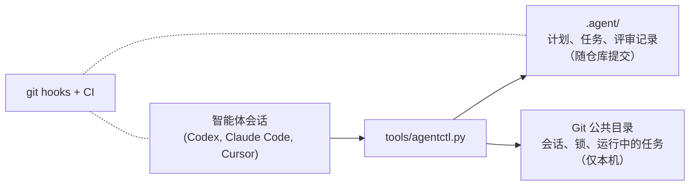

# Agent Workflow Kit（智能体工作流套件）

[](https://github.com/asimfish/agent-workflow-kit/actions/workflows/agent-workflow-check.yml)
[](LICENSE)

[English](README.md) | 中文

给共享仓库和 GPU 机器的 AI 编码智能体做任务追踪与协调。

如果你同时开过好几个智能体会话对着一个项目干活，这些场景你应该都见过：
两个会话领了同一个任务；一个会话死掉后，它占着的任务把其他人永远堵住；
SSH 拉起的实验比会话活得久，从此无人照看；跑完的任务占着 20GB 显存、
利用率为零，一挂就是三天；智能体自己合并了自己没人看过的代码。

这个套件用纯文件和一个 Python 脚本来防住这些事。没有守护进程，没有服务器，
除 Python 3.9 外零依赖。智能体把计划、任务、评审决定写进 `.agent/` 目录的
Markdown 和 JSON，像普通文件一样提交；运行态（谁在干活、什么被锁、哪些进程
和显卡被占）放在 Git 公共目录里，只留在本机。git hooks 和 CI 负责检查智能体
想提交的东西。

## 安装

```bash
git clone https://github.com/asimfish/agent-workflow-kit.git
cd agent-workflow-kit
./install.sh /path/to/your/project
```

或者直接在你的项目里对智能体说一句：
`Install https://github.com/asimfish/agent-workflow-kit.git into this project.`

安装会和已有文件合并而不是覆盖，重复执行无害。装好之后，人只需要一句提示词：

```text
按 .agent 规范开始工作。
```

细节、升级、迁移见 `docs/install-and-upgrade.md`。

## 第一个任务的完整走法

第一天用起来是什么样，提前心里有数。人只做第 1 步和第 5 步，
其余由智能体按 `.agent/WORKFLOW_ENTRY.md` 自己完成。

**1. 把会话指向项目。** 对任意智能体会话说「按 .agent 规范开始工作。」
它在碰任何文件之前先领任务：

```bash
agentctl work --agent codex                 # 领取已有任务
agentctl work --agent codex --auto-create \
    --title "fix the data loader" --scope "src/data/"   # 或新建一个
```

领取会登记写入范围。第二个会话想领同一任务、或申请重叠范围，都会被
拒绝——这正是设计目的。

**2. 智能体干活并留痕。**

```bash
agentctl note "root cause: off-by-one in shard split"
```

**3. 长任务不随对话消亡。** 跑几个小时的东西走 `run start` 而不是裸
shell，对话死了任务照跑，还能在板上看到：

```bash
agentctl run start --task T-001 --output outputs/T-001/ \
    --resource gpu:0 --gpu-watchdog -- python train.py
agentctl run list                            # 状态、PID、日志
```

带 `--gpu-watchdog` 时，占着显存零利用率超过宽限期的进程会被回收；
编译阶段可以声明豁免。

**4. 智能体把任务交给评审。**

```bash
agentctl finish --summary "..." --tests "pytest -x: 42 passed"
```

任务进入 `review`，git hooks 从此挡住未评审工作的推送。由*另一个*
会话——运行时从未碰过实现的那种——领取评审任务并裁决：

```bash
agentctl gate approve --task T-001 --by reviewer-name --note "..."
```

自批会失败：控制器比对的是运行时指纹，不是自觉。代码任务在独立
worktree 里进行；过门之后按 `docs/worktree-merge-back.md` 把结果走回
主分支。

**5. 你随时来看一眼。**

```bash
agentctl board      # 谁在干什么、哪些任务在跑
agentctl doctor     # 过期会话、孤儿租约、互锁的 GPU
```

`doctor` 对每个问题给出恢复命令；不会背着你回收任何东西。

## 工作原理



智能体做的每件事都经过 `agentctl`。开工即认领一个任务和一个写范围；同一
任务不能被两个会话持有，写范围重叠会被拒绝。心跳断了的会话变成过期状态：
其他智能体会看到警告但照常干活，没有人能悄悄接管它的任务。

长任务用 `agentctl run` 跑，它比启动它的会话活得久。run 可以租一张 GPU，
可选的 watchdog 会在进程占着显存但长时间零利用率、零进度时回收这张卡——
有宽限期，有给编译阶段用的豁免机制，遥测失败时宁可不杀。这套在真实共享的
RTX 5090 上实测过，不只是单元测试。

合并进 main 需要两样东西：CI 全绿，加上一条评审批准——批准者所在会话的
运行时必须可证明地从未参与过实现。智能体不能给自己的工作放行，这由控制器
校验，不靠智能体自觉。

## 日常命令

```text
agentctl work --agent <name>            认领或恢复任务
agentctl note "..."                     记录进度
agentctl finish --summary ... --tests   任务交付评审
agentctl run start -- <command>         受监管的后台任务
agentctl gate approve --task --by       独立评审批准
agentctl board                          大家都在干什么
agentctl doctor                         工作流是否健康
```

完整命令表在 `docs/workflow.md`。多数时候上面七条够用；循环、supervisor
指导包、harness 评估、升级屏障这些放在 `docs/` 里，用到再看。

## 它不做什么

不带后台守护进程，不带 cron，不自动合并保护分支，不自动删 worktree 或
分支，也不做沙箱——hooks 是协调护栏，不受信任的代码仍然需要真正的沙箱。
绕过 `agentctl run` 启动的任务（裸 ssh、systemd）只会被报告，不会被接管。

## 现状与已知限制

控制器、租约模型、GPU 监管和评审门禁有 208 个回归测试、Linux 与 Windows
双平台 CI，以及一轮对全新克隆做的七场景端到端验收。验收在关键处是对抗式
的：伪造租约时间戳、删除会话记录、制造孤儿资源、重放创建请求、同运行时
自批——全部按设计被拒绝或自愈。

验收发现的粗糙点已经修复：`agentctl reconcile merge-back` 会把 worktree
里完成的任务账本搬回 planning 检出（见 `docs/worktree-merge-back.md`）；
显式的 `--auto-create` 请求不会再静默续用无关的旧任务；worktree 隔离与
评审门禁的拒绝提示现在会指向真正能解除拒绝的那一步。

## 文档

- `docs/install-and-upgrade.md` —— 安装、升级、迁移
- `docs/workflow.md` —— 任务生命周期、评审门禁、worktree
- `docs/multi-session-execution.md` —— 协调规则与 GPU 监管
- `docs/worktree-merge-back.md` —— 把完成的 worktree 任务走到被批准的合并
- `docs/loop-engineering.md` —— 检查点循环
- `docs/harness-evaluation.md` —— 如何评估对套件本身的修改
- `CHANGELOG.md`、`CONTRIBUTING.md`、`LICENSE`

MIT 许可。贡献走套件自己强制的那套任务加评审流程，见 `CONTRIBUTING.md`。
