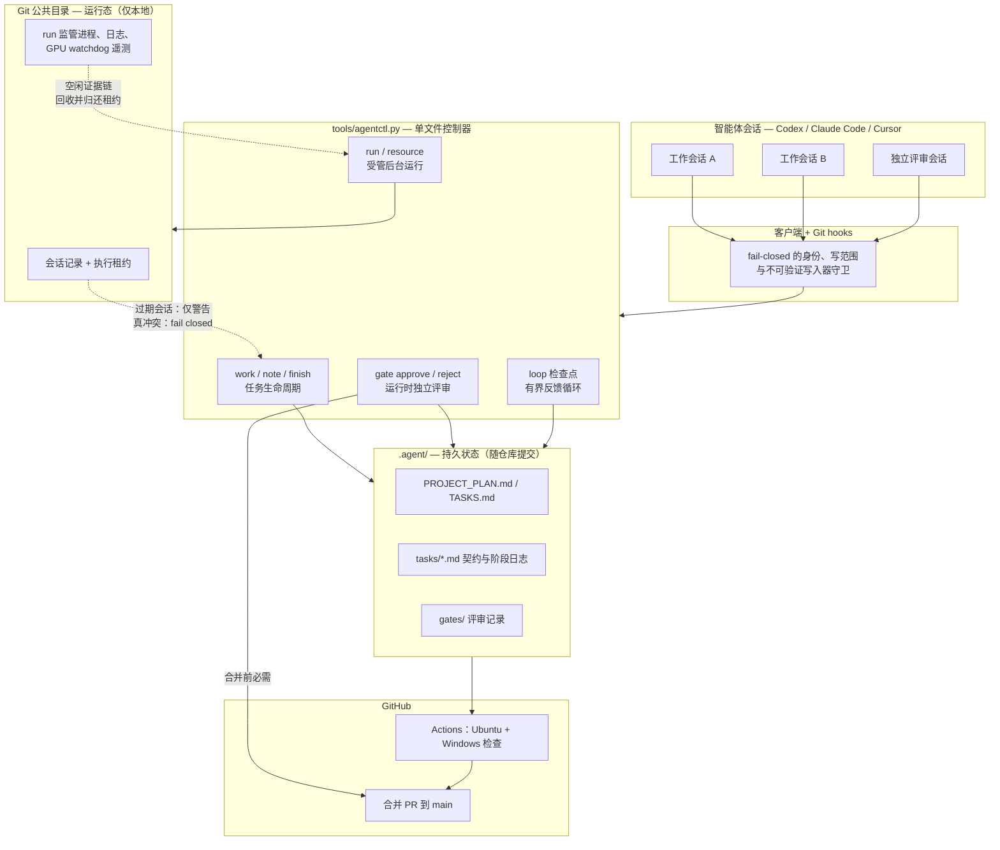

# Agent Workflow Kit（智能体工作流套件）

[](https://github.com/asimfish/super_project/actions/workflows/agent-workflow-check.yml)
[](LICENSE)
[](tools/agentctl.py)
[](.github/workflows/agent-workflow-check.yml)

[English](README.md) | **中文**

项目级 AI 智能体工作流套件。安装进任意 Git 仓库后，Codex、Claude Code、Cursor
或其他编码智能体都会遵循同一套计划、任务文档、循环检查与 GitHub 规范——人不用
每次重复交代流程。一个零依赖的 Python 文件、可提交的 Markdown 持久状态、
fail-closed 的多会话协调。

仓库：<https://github.com/asimfish/super_project>

## 快速开始

在目标项目里对智能体说：

```text
Install https://github.com/asimfish/super_project.git into this project.
```

或手动安装：

```bash
git clone https://github.com/asimfish/super_project.git
cd super_project
./install.sh /path/to/your/project        # 等价于 python3 tools/agentctl.py init <path>
```

安装前有预检且可重复执行：已有的 `AGENTS.md`、PR 模板、各客户端 hook JSON
在受管段内合并，项目自有的 `.agent/` 内容只在缺失时播种。客户端询问时信任
项目 hooks，然后用人类唯一需要的提示词开始工作：

```text
按 .agent 规范开始工作。
```

升级、排水屏障、`upgrade rebind`、`migrate` 动作与身份策略见
`docs/install-and-upgrade.md`。

## 安装内容

```text
AGENTS.md
tools/agentctl.py
tools/agent_workflow_hook.py
.githooks/{pre-commit,commit-msg,pre-push}
.codex/hooks.json
.claude/settings.json
.cursor/hooks.json
.github/workflows/agent-workflow-check.yml
.agent/
  WORKFLOW_ENTRY.md
  PROJECT_PLAN.md
  TASKS.md
  board.json
  agents.json
  tasks/  loops/  rules/  logs/  handoffs/  decisions/  gates/
  state/          # 仅本地，gitignore；含生成的 SESSIONS.md
```

安装出的 `.agent/` 属于该项目，不是全局智能体记忆。

## 架构



读图方式：会话从不直接碰状态——每次工具调用都过 hook 守卫，每次状态变更都经
控制器。持久状态（计划、任务契约、门禁记录）随仓库提交并接受评审；运行态
（会话、租约、run 监管）留在 Git 公共目录并自愈。合并 main 需要 CI 全绿加上
一条由"运行时从未参与实现"的评审者记录的门禁决定。

## 日常使用

正常工作中人不需要运行工作流命令，主要查看和编辑持久状态：

```text
.agent/PROJECT_PLAN.md      方向、优先级、验收标准
.agent/TASKS.md             任务索引（生成视图）
.agent/tasks/*.md           每任务契约、阶段日志、证据
.agent/rules/*.md           操作与 GitHub 规则
.agent/loops/checkpoints.json
```

方向或范围不对就改这些文件；下一次智能体运行必须重读并从持久状态继续。

### 智能体工作循环

1. 读 `AGENTS.md`、`.agent/WORKFLOW_ENTRY.md`、计划与任务文档。
2. `agentctl work --agent <name>`（或 `--auto-create --title ... --scope ...
   --type code|experiment|docs|review|maintenance|generic`）。
3. 只在活动范围或 `work` 打印的受管 worktree 内工作。
4. `agentctl note "..."` 记录进度；`agentctl finish --summary ... --tests ...`
   收尾。
5. 独立评审者（另一个会话，宿主运行时与所有工作运行时都不同）执行
   `agentctl gate approve --task <task> --by <reviewer>`。发过门禁决定的
   review 类任务在 finish 时自动闭环。
6. Conventional Commits + 任务 ID 提交；hooks 通过后才推送。

`work` 与 `finish` 自动运行检查点循环。

## 同一项目多会话并行

在同一项目开多个会话、给同样的短提示词即可，人不需要任何会话管理命令。每个
会话获得私有会话键，在 Git 公共目录发布自己的任务、范围、心跳与声明，并出现
在生成的 `.agent/state/SESSIONS.md` 中。

协调策略一段话：不相交范围可并行；任务类型决定隔离（`code`/`experiment` 用
受管 worktree，`docs` 共享 checkout，`review` 只读，`maintenance` 独占）；同一
任务在所有关联 worktree 间互斥；Git index/分支/推送操作与无法静态验证的写入器
（解释器、构建工具、归档工具、未知可执行文件）按 checkout 独占；控制器文件只
能通过 `agentctl` 命令修改；过期会话对无关工作只是建议性警告，同任务与重叠
范围冲突保持 fail-closed；后台工作走 `agentctl run`，资源租约绑定持有者、监管
入口一次性防重放，可选 GPU watchdog 需要"连续低利用率 + 显存占用 + 无进度 +
宽限期满"的完整证据链才回收——探测失败保留资源，远程 GPU 只报告，终态 run 与
产物按保留期自动过期。

完整不变量、fork/clone 身份绑定、不可验证写入器规则、文档所有权与 GPU 监管
细节：`docs/multi-session-execution.md`。

这些 hooks 是协调护栏而非操作系统沙箱；不受信任的代码仍需外部沙箱。

## 循环

循环是有界反馈周期（Trigger → Execute → Check → Feedback → Memory → Next），
不是后台守护进程。检查点（`work-start`、`pre-finish`、`post-finish`、
`experiment-check`）运行内置循环（如 `daily-plan-triage`、`doc-hygiene`）；
失败会变成持久跟进包，反复失败会升级并阻塞 `finish`，直到修复或显式确认。

```bash
python3 tools/agentctl.py loop run daily-plan-triage --once
python3 tools/agentctl.py loop cycle --checkpoint experiment-check --cycles 6 --interval 600
python3 tools/agentctl.py loop status
```

契约、自定义 `loop-check` 块、循环运行时语义与升级策略：`docs/loop-engineering.md`。

## Supervisor 指导与评估

更强的规划模型可以注册工作会话、发送持久指导包、发起一次有界的非交互工作轮，
并在门禁前校验签名契约、回执、确认与完成证据——工作者无法自批。Harness 变更
还要跑确定性的基线/候选评估（held-in/held-out 套件）。

细节：`docs/workflow.md`（派发与校验）与 `docs/harness-evaluation.md`
（套件模式与信任边界）。

## 常用命令

```text
agentctl init [path]                                安装进项目
agentctl work --agent <name>                        恢复或认领工作
agentctl work --agent <name> --auto-create --title --scope --type
agentctl focus | capsule [--json]                   重印任务焦点 / 有界上下文
agentctl note "..."                                 记录进度
agentctl finish --summary "..." --tests "..."       任务转入评审
agentctl gate approve|reject --task --by            独立评审门禁
agentctl gate reconcile-github --task --by --pr     同步人工合并的 PR 为 done
agentctl guidance create|list|show|ack|dispatch|verify   supervisor 指导包
agentctl eval list|run|show|compare|gate            基线/候选评估
agentctl loop list|show|run|auto|cycle|status|resume|stop
agentctl worktree create|list|release               受管 worktree 租约
agentctl lease list [--json]                        统一执行所有权
agentctl run start|adopt|list|show|wait|progress|finish|stop
agentctl resource acquire|status|release            本地或 SSH 资源租约
agentctl upgrade begin|status|validate|complete|rebind
agentctl reconcile check|render|migrate|close-decided-reviews
agentctl board [--json]                             查看任务板
agentctl check --mode manual|pre-commit|commit-msg|pre-push|ci
agentctl doctor [--json]                            工作流健康检查
agentctl migrate [--json]                           审计升级/旧会话过渡
agentctl sessions list|heartbeat|guard|release      会话记录
```

## GitHub 规范

Conventional Commits + 任务 ID（`Refs: T-001`）。本地 hooks 强制：代码变更须
配套 `.agent` 更新、提交格式、任务引用、可推送任务状态（`review`/`approved`/
`done`）、`done` 任务须有完成记录、密钥扫描；CI 在 Ubuntu 重跑全部检查与回归
套件，在 Windows 跑运行生命周期与派发检查。见 `.agent/rules/github-standards.md`。

## 诊断与测试

```bash
python3 tools/agentctl.py doctor       # 只读工作流健康检查
python3 -m unittest discover -s tests  # 全量回归套件
```

回归测试把套件装进全新的临时 Git 项目，端到端重放协调、循环、指导、worktree、
run/资源、GPU 监管、升级屏障与评估契约。

## 当前边界

刻意不包含：

- 后台守护进程或 cron 调度器；
- 自动 worktree 池或分支删除；
- 外部连接器循环；
- 自动昂贵实验启动；
- 自动合并保护分支；
- 无 held-in/held-out 证据的自动 harness 变更接受。

## 更多文档

- `docs/install-and-upgrade.md`：安装、升级、排水屏障、migrate 动作、身份策略。
- `docs/workflow.md`：完整工作流参考、supervisor 派发、worktree。
- `docs/multi-session-execution.md`：多会话不变量、GPU 监管、保留期。
- `docs/loop-engineering.md`：循环契约与检查点模型。
- `docs/harness-evaluation.md`：确定性套件模式与信任边界。
- `docs/enforcement.md`：hook 与 GitHub 强制层。
- `.agent/rules/github-standards.md`：提交、推送与 PR 规范。
- `CHANGELOG.md`：已发布的重要变更。

## 贡献

贡献走套件自带的同一套工作流——任务、测试、独立评审门禁、PR。见
[CONTRIBUTING.md](CONTRIBUTING.md) 与 issue 模板。

## 许可与引用

MIT——见 [LICENSE](LICENSE)。如果这个套件对你的研究或工具有帮助，请通过
[CITATION.cff](CITATION.cff) 引用。
